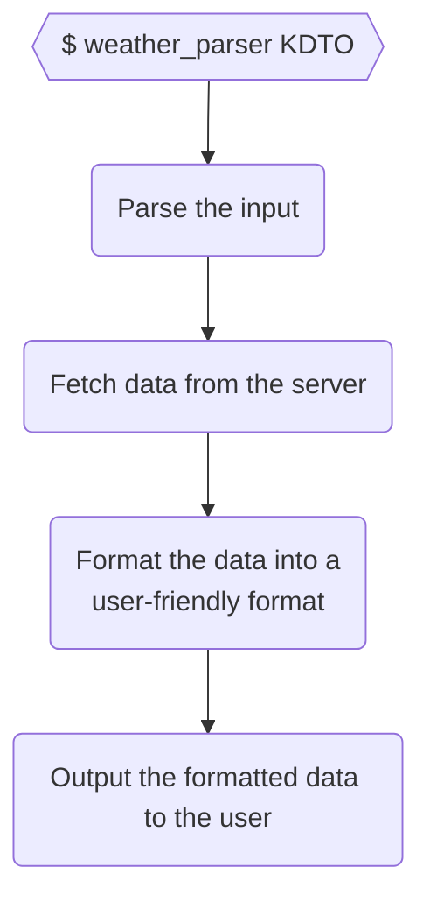

# Elixir Studying — Chapter 13: Organizing a Project

Topics:

- Creating a project with **Mix**
- Adding tests with **ExUnit**
- Using an external library
- Making a CLI Executable with **eScript**
- Creating Documentation with **ExDoc**

## Project Description

> In the United States, the National Oceanic and Atmospheric Administration provides hourly XML feeds of conditions at [1,800 locations](https://w1.weather.gov/xml/current_obs). For example, the feed for a small airport close to where I’m writing this is at
> https://w1.weather.gov/xml/current_obs/KDTO.xml.
>
> Write an application that fetches this data, parses it, and displays it in a nice format.
>
> (Hint: You might not have to download a library to handle XML parsing.)
>
> _<sup>Programming Elixir - Page 168</sup>_

## Breaking it down



## Creating a project with **Mix**

Create the project folder structure with:

```console
mix new weather_parser
```

Details:

- A basic Hello, world! project is created
- Tests are created
- Files have the `.ex` extension

## Creating the Application

### Creating the WeatherParser.CLI module

Create the lib/weather_parser_cli.ex module:

```elixir
defmodule WeatherParser.CLI do
  def run(argv) do
    parse_args(argv)
  end

  def parse_args(argv) do
    case parse_args_from_string(argv) do
      {[help: true], _, _} -> :help
      {_, [location], _} -> location
      _ -> :help
    end
  end

  defp parse_args_from_string(argv) do
    OptionParser.parse(
      argv,
      switches: [help: :boolean],
      aliases: [h: :help]
    )
  end
end
```

Add tests to test/cli_text.exs:

```elixir
defmodule CliTest do
  use ExUnit.Case
  doctest WeatherParser

  import WeatherParser.CLI, only: [parse_args: 1]

  test "returns :help when calling with -h or --help" do
    assert parse_args(["-h", "something"]) == :help
    assert parse_args(["--help", "something"]) == :help
  end

  test "returns the location when the location is passed" do
    assert parse_args(["KDTO"]) == "KDTO"
  end

  test "returns :help when no args are passed" do
    assert parse_args([]) == :help
  end
end
```

Details:

- The OptionParser module
- New tests

### Processing the input

Add code to lib/weather_parser_cli.ex:

```diff
 defmodule WeatherParser.CLI do
   def run(argv) do
-    parse_args(argv)
+    argv
+    |> parse_args()
+    |> process
   end

   def parse_args(argv) do
     case parse_args_from_string(argv) do
       {[help: true], _, _} -> :help
       {_, [location], _} -> location
       _ -> :help
     end
   end

   defp parse_args_from_string(argv) do
     OptionParser.parse(
       argv,
       switches: [help: :boolean],
       aliases: [h: :help]
     )
   end
+
+  def process(:help) do
+    IO.puts("""
+    usage: weather_parser <location>
+    """)
+
+    System.halt(0)
+  end
 end
```

You can run code within the application by running `mix run`, for example:

```console
mix run -e 'WeatherParser.CLI.run(["-h"])'
```

will return:

```console
usage: weather_parser <location>
```

### Adding an external library

Inside mix.exs, add:

```diff
   # Run "mix help deps" to learn about dependencies.
   defp deps do
     [
       # {:dep_from_hexpm, "~> 0.3.0"},
       # {:dep_from_git, git: "https://github.com/elixir-lang/my_dep.git", tag: "0.1.0"},
+      { :httpoison, "~> 1.0.0" }
     ]
   end
 end
```

Fetch the new dependency by running:

```console
mix deps.get
```

Output:

```console
Resolving Hex dependencies...
Dependency resolution completed:
New:
  certifi 2.9.0
  hackney 1.18.1
  httpoison 1.0.0
  idna 6.1.1
  metrics 1.0.1
  mimerl 1.2.0
  parse_trans 3.3.1
  ssl_verify_fun 1.1.6
  unicode_util_compat 0.7.0
* Getting httpoison (Hex package)
* Getting hackney (Hex package)
* Getting certifi (Hex package)
* Getting idna (Hex package)
* Getting metrics (Hex package)
* Getting mimerl (Hex package)
* Getting parse_trans (Hex package)
* Getting ssl_verify_fun (Hex package)
* Getting unicode_util_compat (Hex package)
```

Details:

- The deps/ folder has been updated
- Run `mix deps` to see the dependencies
  - Elixir dependencies: `mix`
  - Erlang dependencies: [rebar3](https://github.com/erlang/rebar3)

### Fetching the data from the w1.weather.gov website

Add a new module to lib/weather_parser/weather_gov.ex:

```elixir
defmodule WeatherParser.WeatherGov do
  @headers [{"User-agent", "Elixir rhian.luis.cs+github@gmail.com"}]

  def fetch(location) do
    location
    |> weather_url()
    |> HTTPoison.get(@headers)
    |> handle_response()
  end

  defp weather_url(location) do
    "https://w1.weather.gov/xml/current_obs/#{location}.xml"
  end

  defp handle_response({:ok, %{status_code: 200, body: body}}) do
    {:ok, body}
  end

  defp handle_response({_, %{status_code: _, body: body}}) do
    {:error, body}
  end
end
```

We can now open the application with `iex`:

```console
iex -S mix
```

This will drop us into the `iex` shell.
