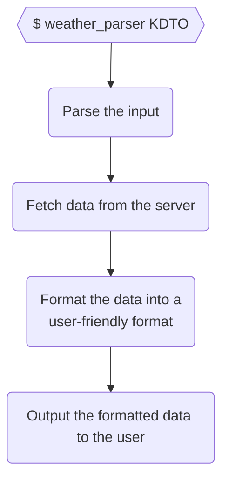

# Elixir Studying — Chapter 13: Organizing a Project

Topics:

- Creating a project with **Mix**
- Adding tests with **ExUnit**
- Using an external library
- Making a CLI Executable with **eScript**
- Creating Documentation with **ExDoc**

## Project Description

> In the United States, the National Oceanic and Atmospheric Administration provides hourly XML feeds of conditions at [1,800 locations](http://w1.weather.gov/xml/current_obs). For example, the feed for a small airport close to where I’m writing this is at
> http://w1.weather.gov/xml/current_obs/KDTO.xml.
>
> Write an application that fetches this data, parses it, and displays it in a nice format.
>
> (Hint: You might not have to download a library to handle XML parsing.)
>
> _<sup>Programming Elixir - Page 168</sup>_

## Breaking it down



## Creating a project with **Mix**

Create the project folder structure with:

```console
mix new weather_parser
```
