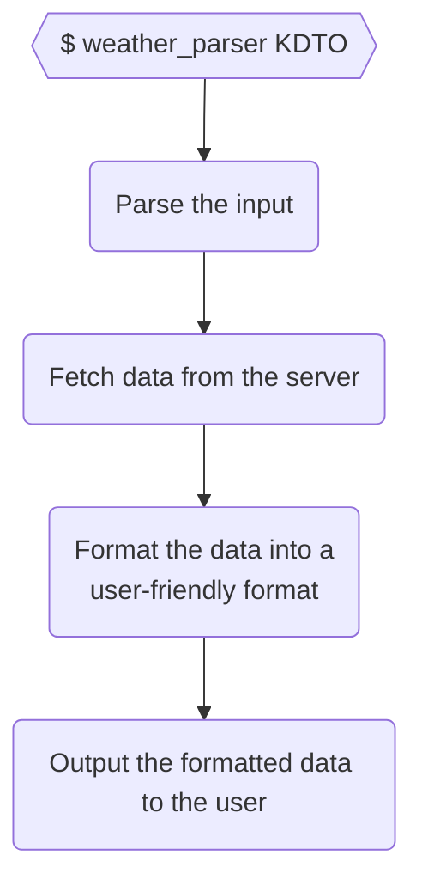

# Elixir Studying — Chapter 13: Organizing a Project

Topics:

- Creating a project with **Mix**
- Adding tests with **ExUnit**
- Using an external library
- Making a CLI Executable with **eScript**
- Creating Documentation with **ExDoc**

## Project Description

> In the United States, the National Oceanic and Atmospheric Administration provides hourly XML feeds of conditions at [1,800 locations](https://w1.weather.gov/xml/current_obs). For example, the feed for a small airport close to where I’m writing this is at
> https://w1.weather.gov/xml/current_obs/KDTO.xml.
>
> Write an application that fetches this data, parses it, and displays it in a nice format.
>
> (Hint: You might not have to download a library to handle XML parsing.)
>
> _<sup>Programming Elixir - Page 168</sup>_

## Breaking it down



## Creating a project with **Mix**

Create the project folder structure with:

```console
mix new weather_parser
```

Details:

- A basic Hello, world! project is created
- Tests are created
- Files have the `.ex` extension

## Creating the Application

### Creating the WeatherParser.CLI module

Create the lib/weather_parser/cli.ex module:

```elixir
defmodule WeatherParser.CLI do
  def run(argv) do
    parse_args(argv)
  end

  def parse_args(argv) do
    case parse_args_from_string(argv) do
      {[help: true], _, _} -> :help
      {_, [location], _} -> location
      _ -> :help
    end
  end

  defp parse_args_from_string(argv) do
    OptionParser.parse(
      argv,
      switches: [help: :boolean],
      aliases: [h: :help]
    )
  end
end
```

Add tests to test/cli_text.exs:

```elixir
defmodule CliTest do
  use ExUnit.Case
  doctest WeatherParser

  import WeatherParser.CLI, only: [parse_args: 1]

  test "returns :help when calling with -h or --help" do
    assert parse_args(["-h", "something"]) == :help
    assert parse_args(["--help", "something"]) == :help
  end

  test "returns the location when the location is passed" do
    assert parse_args(["KDTO"]) == "KDTO"
  end

  test "returns :help when no args are passed" do
    assert parse_args([]) == :help
  end
end
```

Details:

- The OptionParser module
- New tests

### Processing the input

Add code to lib/weather_parser_cli.ex:

```diff
 defmodule WeatherParser.CLI do
   def run(argv) do
-    parse_args(argv)
+    argv
+    |> parse_args()
+    |> process
   end

   def parse_args(argv) do
     case parse_args_from_string(argv) do
       {[help: true], _, _} -> :help
       {_, [location], _} -> location
       _ -> :help
     end
   end

   defp parse_args_from_string(argv) do
     OptionParser.parse(
       argv,
       switches: [help: :boolean],
       aliases: [h: :help]
     )
   end
+
+  def process(:help) do
+    IO.puts("""
+    usage: weather_parser <location>
+    """)
+
+    System.halt(0)
+  end
 end
```

You can run code within the application by running `mix run`, for example:

```console
mix run -e 'WeatherParser.CLI.run(["-h"])'
```

will return:

```console
usage: weather_parser <location>
```

### Adding an external library

Inside mix.exs, add:

```diff
   # Run "mix help deps" to learn about dependencies.
   defp deps do
     [
       # {:dep_from_hexpm, "~> 0.3.0"},
       # {:dep_from_git, git: "https://github.com/elixir-lang/my_dep.git", tag: "0.1.0"},
+      { :httpoison, "~> 1.0.0" }
     ]
   end
 end
```

Fetch the new dependency by running:

```console
mix deps.get
```

Output:

```console
Resolving Hex dependencies...
Dependency resolution completed:
New:
  certifi 2.9.0
  hackney 1.18.1
  httpoison 1.0.0
  idna 6.1.1
  metrics 1.0.1
  mimerl 1.2.0
  parse_trans 3.3.1
  ssl_verify_fun 1.1.6
  unicode_util_compat 0.7.0
* Getting httpoison (Hex package)
* Getting hackney (Hex package)
* Getting certifi (Hex package)
* Getting idna (Hex package)
* Getting metrics (Hex package)
* Getting mimerl (Hex package)
* Getting parse_trans (Hex package)
* Getting ssl_verify_fun (Hex package)
* Getting unicode_util_compat (Hex package)
```

Details:

- The deps/ folder has been updated
- Run `mix deps` to see the dependencies
  - Elixir dependencies: `mix`
  - Erlang dependencies: [rebar3](https://github.com/erlang/rebar3)

### Fetching the data from the w1.weather.gov website

Add a new module to lib/weather_parser/weather_gov.ex:

```elixir
defmodule WeatherParser.WeatherGov do
  @headers [{"User-agent", "Elixir rhian.luis.cs+github@gmail.com"}]

  def fetch(location) do
    location
    |> weather_url()
    |> HTTPoison.get(@headers)
    |> handle_response()
  end

  defp weather_url(location) do
    "https://w1.weather.gov/xml/current_obs/#{location}.xml"
  end

  defp handle_response({:ok, %{status_code: 200, body: body}}) do
    {:ok, body}
  end

  defp handle_response({_, %{status_code: _, body: body}}) do
    {:error, body}
  end
end
```

We can now open the application with `iex`:

```console
iex -S mix
```

This will drop us into the `iex` shell.

### Formatting the XML response

Parse the output at the WeatherGov module:

```diff
   defp handle_response({:ok, %{status_code: 200, body: body}}) do
-    {:ok, body}
+    {:ok, WeatherXmlParser.parse(body)}
   end
```

Add a XML Node helper ([source](https://gist.github.com/sasa1977/5967224)):

```elixir
# Original by sasa1977 at https://gist.github.com/sasa1977/5967224

defmodule XmlNode do
  require Record

  Record.defrecord(
    :xmlAttribute,
    Record.extract(:xmlAttribute, from_lib: "xmerl/include/xmerl.hrl")
  )

  Record.defrecord(:xmlText, Record.extract(:xmlText, from_lib: "xmerl/include/xmerl.hrl"))

  def from_string(xml_string, options \\ [quiet: true]) do
    {doc, []} =
      xml_string
      |> :binary.bin_to_list()
      |> :xmerl_scan.string(options)

    doc
  end

  def all(node, path) do
    for child_element <- xpath(node, path) do
      child_element
    end
  end

  def first(node, path), do: node |> xpath(path) |> take_one
  defp take_one([head | _]), do: head
  defp take_one(_), do: nil

  def node_name(nil), do: nil
  def node_name(node), do: elem(node, 1)

  def attr(node, name), do: node |> xpath('./@#{name}') |> extract_attr
  defp extract_attr([xmlAttribute(value: value)]), do: List.to_string(value)
  defp extract_attr(_), do: nil

  def text(node), do: node |> xpath('./text()') |> extract_text
  defp extract_text([xmlText(value: value)]), do: List.to_string(value)
  defp extract_text(_x), do: nil

  defp xpath(nil, _), do: []

  defp xpath(node, path) do
    :xmerl_xpath.string(to_charlist(path), node)
  end
end
```

Create the WeatherXmlParser module:

```elixir
defmodule WeatherXmlParser do
  def parse(xml_string) do
    xml_string
    |> XmlNode.from_string()
    |> XmlNode.first('/current_observation')
    |> format_as_internal_representation()
  end

  @attributes_to_fetch [:location, :weather, :temp_c]

  defp format_as_internal_representation(xml) do
    Enum.map(@attributes_to_fetch, &fetch_attribute_from_xml(&1, xml))
  end

  defp fetch_attribute_from_xml(attribute, xml) do
    {attribute, parse_element(attribute, xml)}
  end

  defp parse_element(attribute, xml) do
    xml
    |> XmlNode.first(attribute)
    |> XmlNode.text()
  end
end
```

Add the process function at the CLI module:

```diff
+
+  def process(location) do
+    WeatherParser.WeatherGov.fetch(location)
+    |> decode_response()
+    |> pretty_output()
+  end
+
+  def decode_response({:ok, weather}), do: weather
+
+  def decode_response({:error, error}) do
+    IO.puts("Error fetching weather: #{error}")
+    System.halt(2)
+  end
+
+  def pretty_output(weather) do
+    "The weather at #{weather[:location]} is #{weather[:weather]} at #{weather[:temp_c]}°C."
+    |> IO.puts()
+  end
 end
```

This can also be tested with:

```console
mix run -e 'WeatherParser.CLI.run(["KDTO"])'
```

### Add Application Configuration

Create or add to the config/config.exs file:

```elixir
use Mix.Config
config :weather_parser, api_url: "https://w1.weather.gov"
```

You can then call this configuration within the application, at lib/weather_parser/weather_gov.ex:

```diff
 defmodule WeatherParser.WeatherGov do
+  @api_url Application.get_env(:weather_parser, :api_url)
   @headers [{"User-agent", "Elixir rhian.luis.cs+github@gmail.com"}]

   def fetch(location) do
```

```diff
 defmodule WeatherParser.WeatherGov do
   end

   defp weather_url(location) do
-    "https://w1.weather.gov/xml/current_obs/#{location}.xml"
+    "#{@api_url}/xml/current_obs/#{location}.xml"
   end
```

Details:

- You can also import configurations from other files with `import_config "#{Mix.env}.exs"`

### Generating a command line executable

Add configuration to the mix.exs file:

```diff
   def project do
     [
       app: :weather_parser,
+      escript: escript_config(),
       version: "0.1.0",
       elixir: "~> 1.10",
       start_permanent: Mix.env() == :prod,
       deps: deps()
     ]
   end
```

```diff
   defp deps do
     [
       # {:dep_from_hexpm, "~> 0.3.0"},
       # {:dep_from_git, git: "https://github.com/elixir-lang/my_dep.git", tag: "0.1.0"},
       {:httpoison, "~> 1.0.0"}
     ]
   end
+
+  defp escript_config do
+    [
+      main_module: WeatherParser.CLI
+    ]
+  end
 end
```

Rename the `run` function at lib/weather_parser/cli.ex to `main`:

```diff
 defmodule WeatherParser.CLI do
-  def run(argv) do
+  def main(argv) do
     argv
     |> parse_args()
     |> process
```

Finally, generate the executable with:

```console
mix escript.build
```

You can then run the application with:

```console
./weather_parser <location>
```

### Adding a logger

Details:

- There are four levels of messages: `debug`, `info`, `warn` and `error`.
- Some log levels are purged at compile time

Verify that `:logger` is present in the `application` method at mix.exs:

```elixir
def application do
  [
    extra_applications: [:logger]
  ]
end
```

Add logging configuration at config/config.exs:

```elixir
config :logger, compile_time_purge_level: :info
```

Add logs to each function in the WeatherGov module:

```diff
 defmodule WeatherParser.WeatherGov do
+  require Logger
+
   @api_url Application.get_env(:weather_parser, :api_url)
   @headers [{"User-agent", "Elixir rhian.luis.cs+github@gmail.com"}]

   def fetch(location) do
+    Logger.info("Fetching weather data for location #{location}.")
+
     location
     |> weather_url()
     |> HTTPoison.get(@headers)
@@ -14,6 +18,8 @@ defmodule WeatherParser.WeatherGov do
   end

   defp handle_response({:ok, %{status_code: 200, body: body}}) do
+    Logger.debug("Weather API responded with body: #{body}.")
+
     {:ok, WeatherXmlParser.parse(body)}
   end
```

You can then see the logs when running the application:

```
iex(1)> WeatherParser.CLI.process("KDTO")

17:56:47.774 [info]  Fetching weather data for location KDTO.
The weather at Denton Enterprise Airport, TX is Fair at 27.2°C.
:ok
```

### Adding documentation

Update the mix.exs file:

```diff
   def project do
     [
       app: :weather_parser,
       escript: escript_config(),
       version: "0.1.0",
+      name: "Weather Parser",
       elixir: "~> 1.10",
       start_permanent: Mix.env() == :prod,
       deps: deps()
     ]
   end
```

```diff
   defp deps do
     [
       # {:dep_from_hexpm, "~> 0.3.0"},
       # {:dep_from_git, git: "https://github.com/elixir-lang/my_dep.git", tag: "0.1.0"},
-      {:httpoison, "~> 1.0.0"}
+      {:httpoison, "~> 1.0.0"},
+      {:ex_doc, "~> 0.27"},
+      {:earmark, "~> 1.4.24"}
     ]
   end
```

Add some actual documentation:

```diff
 defmodule WeatherParser.CLI do
+  @moduledoc """
+  Handle the command line parsing and the dispatch
+  to the module that fetches weather data from
+  the american weather API
+  """
   def main(argv) do
     argv
     |> parse_args()
     |> process
   end

+  @doc """
+  `argv` can be -h or --help, which returns :help.
+
+  Otherwise it is expected to be an american location, e.g. `KDTO`.
+
+  Returns :help if help was called, otherwise returns the specified
+  location.
+  """
   def parse_args(argv) do
     case parse_args_from_string(argv) do
       {[help: true], _, _} -> :help
```

Update the dependencies by running:

```console
mix deps.get
```

Generate the documentation with:

```console
mix docs
```
